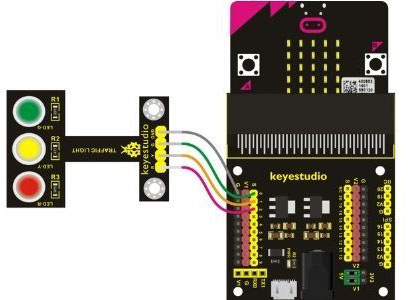

Уличный светофор
****************

Запрограммировать режим работы светофора:
1. включить красный светодиод
2. ожидание 5 секунд
3. выключить красный светодиод
4. включить желтый светодиод
5. подождать 5 секунды
6. выключить желтый светодиод
7. включить зелёный светодиод
8. подождать 5 секунд
9.выключить зеленый светодиод

    
Программа
---------

.. include:: Street_traffic.py
    :code: python