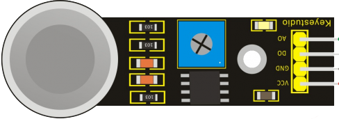

Датчик углекислого газа
-----------------------

:download:`Скачать файл с классов <Analog_Gas.py>`

Класс
*****

.. py:class::
    Analog_Gas

Класс используется для определения объектов, имеющих поведение датчика углекислого газа.
    
Пример объявления объекта::

    gas=Analog_Gas(pin0)

.. py:function:: gas.calibrate()

Команда позволяет провести каллибровку датчика. Прогревает датчик в течении 20 секунд.
Далее Вы вращаете подстроечный резистор, пока не погаснет красный светодиод.
Пробуете поднести датчик к углекислому газу (дышать на него) - диод должен загореться. 
Убираете датчик - диод гаснет.
Подтверждаете калибровку, удерживая **кнопку "А"**. Выводится показание датчика.

.. py:function:: gas.get_signal()

Команда позволяет получить аналоговый сигнал с датчика

Пример программы
****************

.. include:: sample.py
    :code: python