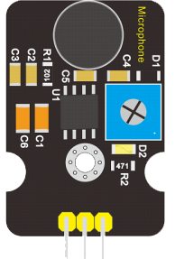

Аналоговый микрофон
-------------------

:download:`Скачать файл с классов <Analog_Sound.py>`

Датчик звука используется для отслежения уровня шума или обнаружения громких сигналов: 
хлопков, стуков или свиста. Регулятором чувствительности можно выбирать, от какого звука 
будет срабатывать датчик - от слабого, громкого или очень громкого звука.

Библиотека помогает откалибровать звуковой датчик KY038 с помощью micro:bit. 
Он также обеспечивает функцию счетчика хлопков. Предполагается, что цифровой выход звукового 
датчика подключен к контакту 0 микробита. Он использует аналоговый вход, так как цифровой 
вход кажется не очень надежным для питания датчика 3В. Питание и земля датчика также 
подключены к micro:bit.

Класс
*****

.. py:class::
    Analog_Sound

Класс используется для определения объектов, имеющих поведение датчика звука

Пример объявления объекта::

    mic=Analog_Sound(pin0)

.. py:function:: mic.calibrate()

Калибровка звукового датчика. Стрелка показывает на вращение подстроечного 
резистора. Если на экране стрелка, то вращайте подстроечный резистор и делайте хлопки.
Ряды красных светодиодов показывают приемлемый звуковой сигнал.

.. py:function:: mic.count_claps(self,sleep_time=100)

Команда возвращает количество хлопков, которые датчик звука зафиксировал.
Параметр  **sleep_time** отражает паузу между хлопками. При медленных хлопках
показатель необходимо увеличить.

.. py:function:: mic.level_sound()

Команда возвращает аналоговое значение датчика

Пример программы
****************

.. include:: sample.py
    :code: python