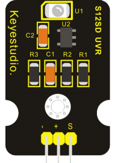

Датчик ультрафиолета
--------------------

:download:`Скачать файл с классов <GUVA-Ultraviolet.py>`

Датчик можно использовать для контроля интенсивности ультрафиолетового света или использовать в 
качестве УФ-детектора пламени.

Класс
*****

.. py:class::
    GUVA-Ultraviolet

.. py:function:: ??()

Пример программы
****************

.. include:: sample.py
    :code: python