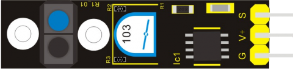

Модуль отслеживания линии
-------------------------

:download:`Скачать файл с классов <Line_Tracking.py>`

**Датчик отслеживания** линии позволяет определять цвет поверхности.
Единица — чёрный или пустота, ноль — не чёрный.

Переменный резистор, установленный на сенсоре, позволит регулировать чувствительность сенсора в широких
пределах. Это позволяет откалибровать датчик под материал покрытия и внешнее освещение.

Класс
*****

.. py:class::
    Line_Tracking

.. py:function:: ??()

Пример программы
****************

.. include:: sample.py
    :code: python