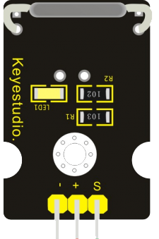

Датчик геркона
--------------

Класс
*****

.. py:class::
    Reed_Switch

Класс используется для определения объектов, имеющих поведение геркона 
    
Пример объявления объекта::

    switch=Push_Button(pin0)

.. py:function:: switch.is_pressed()

    Команда возвращает **True**, если есть магнитное поле рядом с герконом

.. py:function:: switch.count_pressed()

    Команда возвращает количество прошедших ее опросов методом **is_pressed()**,
    при которых геркон был замкнут

.. py:function:: switch.reset_pressed()

    Команда сбрасывает счетчик замыканий геркона или количество положительных результатов 
    при вызоме метода **is_pressed()**

Пример программы
****************

.. include:: sample.py
    :code: python