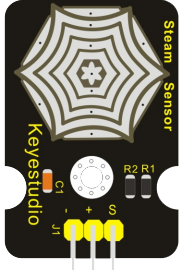

Датчик пара
-----------

:download:`Скачать файл с классов <Steam.py>`

**Датчик пара** представляет собой аналоговый датчик, который может использоваться как простой датчик дождевой
воды или датчик уровня жидкости.
Когда влажность на чувствительной области этого датчика повышается, выходное напряжение его сигнального
конца увеличивается.

Класс
*****

.. py:class::
    Steam

.. py:function:: ??()

Пример программы
****************

.. include:: sample.py
    :code: python