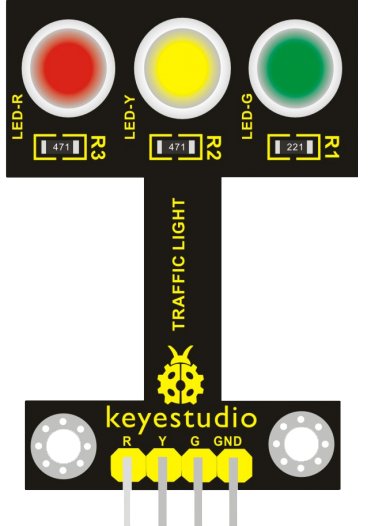

Модуль светофор
---------------

:download:`Скачать файл с классов <Traffic_Light.py>`

Модель имеет три светодиода - отражает работу светофора. Имеет 4 пина. 
Три для управления напряжением на светодиодах и один GND

Класс
*****

.. py:class::
    Traffic_Light

Класс используется для определения объектов, имеющих поведение светодиодного светофора 
    
Пример объявления объекта::

    led=Traffic_Light(red=pin0, yellow=pin1, blue=pin2)

.. py:function:: led.on_red()

    Команда позволяет включить красный светодиод. 
    Аналогичные команды **on_yellow()** и **on_blue()**.

.. py:function:: led.off_red()

    Команда позволяет выключить красный светодиод.
    Аналогичные команды **off_yellow()** и **off_blue()**.

.. py:function:: led.off()

    Команда позволяет выключить все светодиоды полностью

Пример программы
****************

.. include:: sample.py
    :code: python