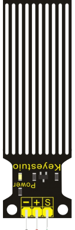

Датчик протечки
---------------

:download:`Скачать файл с классов <Water.py>`

Датчик может измерять объем капли воды или количество воды по множеству следов открытых параллельных
линий и уменьшения сопротивляемости.

Класс
*****

.. py:class::
    Water

.. py:function:: ??()

Пример программы
****************

.. include:: sample.py
    :code: python