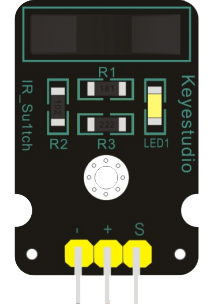

Датчик Фотопрерыватель
----------------------

:download:`Скачать файл с классов <Photo_Interrupter.py>`

**Фотопрерыватели** широко используются во многих областях, таких как измерение скорости, позиционирование 
и подсчет.

Небольшие бытовые приборы, оптические концевые выключатели, обнаружение объектов и так далее.

Класс
*****

.. py:class::
    Photo_Interrupter

.. py:function:: ??()

Пример программы
****************

.. include:: sample.py
    :code: python