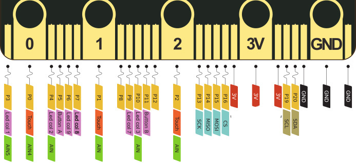

Контакты/Пины
-----------------

Вдоль нижнего края располагаются контакты/пины. Каждый пин имеет свой номер. Пять больших
площадок и 20 тонких. Большие площадки подписаны: **0,1,2,3V, GNG**. К ним легко подключаться 
используя провода с зажимом типа **крокодил**

.. image:: blue-microbit.png
    :width: 300px
    :align: center
    :alt: micro:bit with pins labelled

Другие пины удобно использовать с шилдами - платы расширения

В последней версии Microbit **V2** логотип micro:bit также можно использовать в качестве сенсорного экрана.

В MicroPython каждый пин представлен как объект типа ``pinN``, где ``N`` 
это номер пина. 

Пин с логотипом в Microbit **V2** называется ``pin_logo``.

Не все пины имеют одинаковые методы (команды). Это зависит от его функционала,
который заложили разработчики

* ``PN`` - номер пина в линейке
* ``Led colN`` - пин дублируется в управлении дисплеем. Для его использования необходимо отключить дисплей
* ``Button N`` - пин дублируется в управлении кнопок. 
* ``3V`` - пин питания 3 вольта (+). Используется для питания устройств и датчиков
* ``GND`` - пин земля (-)
* ``AIN`` - аналоговый пин. 

К пинам подсоединяются различные устройтва и датчики. Конкретнее это прописанно в статьях про устройтва