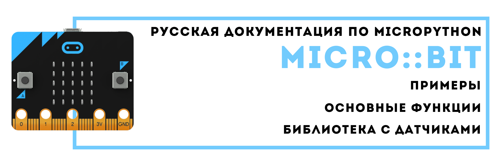

:page_with_curl:	Перевод основной документации https://microbit-micropython.readthedocs.io/en/v2-docs/ 

:gear: Внесение дополнительных примеров

:joystick: Расширенна примерами учебных заданий для детей

# Создание раздела по работе с датчиками (каталог Docs-ru/docs/source/sensor/sensor)

:loudspeaker: Создана библиотека классов по работе с датчиками, которую Вы можете подключить и использовать в проектах. 
Разделение классов и простая структура кода связанно с переносом файлов с классами на микроконтроллер.

:blue_book: Добавлено описание работы с классами в документацию

# Копируем модуль:
1) Сохраните файл на свой компьютер.
2) Скопируйте файл в в корневой каталог программы MU (...\mu_code\).
4) Напишите и прошейте вашу программу в Мu.
5) На экране будет прокручиваться сообщение об ошибке и отсутствии библиотеки.
6) После завершения щелкните значок «Files» в Mu и загрузите файл на свой микробит (перетащите в левую колонку).
7) Нажмите Перезагрузку на Microbit.

# :frowning_man::frowning_man::frowning_man: Совместная работа с документацией
Документация создана с использование инструмента SPHINX (https://www.sphinx-doc.org/)

Sphinx использует reStructuredText в качестве языка разметки и формирует файлы html на их основе.

# Документы с описанием располагаются в папках: 

Docs-ru/docs/source/tutorials/

Docs-ru/docs/source/api/

Docs-ru/docs/source/sensor/

Связаться с автором проекта (http://texnoit.com/)
